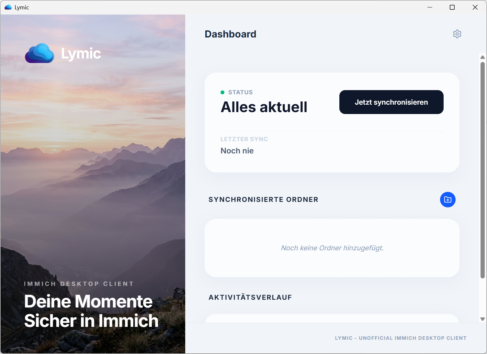

<p align="center">
  
</p>

# Lymic — Desktop upload client for Immich

[](LICENSE)
[](https://tauri.app/)
[](https://kit.svelte.dev/)

**Lymic** is an unofficial, cross-platform desktop client for uploading and synchronizing local media with [Immich](https://immich.app/). It watches selected local folders, detects supported media, avoids uploading assets that already exist on Immich, and streams missing files from disk.

> Lymic is an upload-oriented client, not a two-way filesystem mirror. It does not download remote assets, mirror remote deletions, rename local files, or manage albums as part of its normal synchronization workflow.



---

## Features

- **Efficient synchronization** — Unchanged files reuse their cached SHA-1/Base64 after a current size-and-mtime check; only changed or uncached files are streamed for hashing, while Immich bulk checks prevent unnecessary transfers.
- **Folder watching** — Recursively monitors watched folders, handles changes with a debounce, and rescans after watcher overflow.
- **Large-file support** — Streams multipart uploads directly from disk without retaining full files in memory.
- **Durable queue** — Persists synchronization work, pause state, progress, and failures locally; failed items can be retried.
- **Secure credentials** — Stores API keys in the platform-native keyring (Keychain, Credential Manager, or Secret Service).
- **Desktop experience** — Provides real-time status, progress, system-tray controls, notifications, optional autostart, light/dark themes, and English/German UI.
- **Media-aware uploads** — Supports broad, extension-based media detection, recognized live-photo/motion pairs, and optional XMP sidecars.

---

## Technology

| Layer | Technology |
|---|---|
| **Backend** | [Rust](https://www.rust-lang.org/) + [Tauri v2](https://tauri.app/) |
| **Frontend** | [SvelteKit](https://kit.svelte.dev/) + [TypeScript](https://www.typescriptlang.org/) |
| **Styling** | [Tailwind CSS v4](https://tailwindcss.com/) |
| **Icons** | [Lucide](https://lucide.dev/) |
| **Database** | [SQLite](https://sqlite.org/) via [SQLx](https://github.com/launchbadge/sqlx) |
| **Networking** | [Reqwest](https://github.com/seanmonstar/reqwest) (HTTP / multipart streaming) |

---

## Getting started

### Download

Download the latest installer for your operating system from the [Lymic releases](https://github.com/xXRoxXeRXx/lymic/releases) page.

> [!IMPORTANT]
> **macOS Users:** Since this is an open-source project without a paid Apple Developer certificate, macOS will block the app as "unidentified" or "damaged".
>
> **Option 1 (Recommended):**
> 1. Drag the app into your **Applications** folder.
> 2. **Right-click** (or Control-click) the app icon and select **Open**.
> 3. Click **Open** in the confirmation dialog.
>
> **Option 2 (If Option 1 fails):**
> If you still see the "App is damaged" message, run the following command in your terminal:
> ```bash
> xattr -cr /Applications/Lymic.app
> ```

### Building from Source

#### Prerequisites

- [Rust](https://www.rust-lang.org/tools/install) (latest stable)
- [Node.js](https://nodejs.org/) (v18+)
- OS-specific dependencies (see [Tauri prerequisites](https://tauri.app/start/prerequisites/))

#### Steps

1. **Clone the repository**
   ```bash
   git clone https://github.com/xXRoxXeRXx/lymic.git
   cd lymic
   ```

2. **Install dependencies**
   ```bash
   npm install
   ```

3. **Run in development mode**
   ```bash
   npm run tauri dev
   ```

4. **Build for production**
   ```bash
   npm run tauri build
   ```

---

## Connect to Immich

Generate an API key in the Immich web interface under **Account Settings → API Keys**, then enter the server URL and key in Lymic.

The server URL must use **HTTPS** and must not include embedded credentials, a query string, or a fragment. Redirects are intentionally disabled, so configure your reverse proxy to expose the final HTTPS endpoint directly.

### Required Permissions (Scopes)

| Scope | Purpose |
|---|---|
| `asset.upload` | Transmit new media files to the server |
| `asset.read` | Verify whether a file already exists before uploading |
| `server_info.read` | Validate the connection and check server compatibility |

Lymic normally does not require `asset.delete` or `album.write` permissions. Sign-in validates the authenticated user, so ensure the key and installed Immich version allow that account lookup.

---

## How synchronization works

1. **Discover** — Lymic recursively scans watched folders at startup and when a folder is added. Filesystem events trigger later incremental work.
2. **Classify and hash** — It detects supported media, live-photo/motion pairs, and optional XMP sidecars. Files whose current size and mtime match their synchronized cache entry reuse its SHA-1/Base64; changed or uncached files are streamed to calculate it. Hashes are cached in SQLite alongside file metadata.
3. **Check** — SHA-1/Base64 values are sent to Immich's bulk check in batches; existing assets are skipped.
4. **Queue and upload** — Missing assets are written to the durable queue and streamed to Immich with configurable parallelism, using SHA-1/Base64 in the `x-immich-checksum` header.
5. **Record** — Completion and failure details are persisted and shown in the UI. Paused work can resume safely after a restart.

Duplicate and overlapping watched folders are rejected. Temporarily unavailable folders remain configured and are retried. Closing the main window hides Lymic to the system tray; use the tray menu to quit.

For complete synchronization behavior, supported pairing rules, security details, local-data retention, architecture, development checks, release workflow, and troubleshooting, see the **[full project documentation](docs/README.md)**.

---

## Contributing

Contributions are welcome! Please read [CONTRIBUTING.md](CONTRIBUTING.md) before opening a pull request.

---

## Disclaimer

**Lymic is an unofficial community project and is not affiliated with, maintained, or endorsed by the official Immich team.** Use it at your own risk. Always keep backups of your precious media.

---

## License

This project is licensed under the [MIT License](LICENSE).

---

<p align="center">
  Made with ❤️ for the Immich Community
</p>
